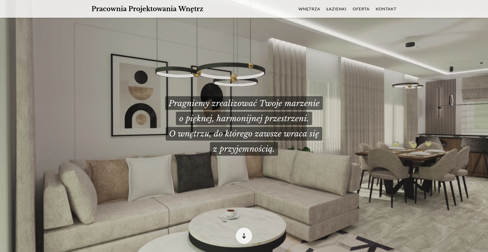
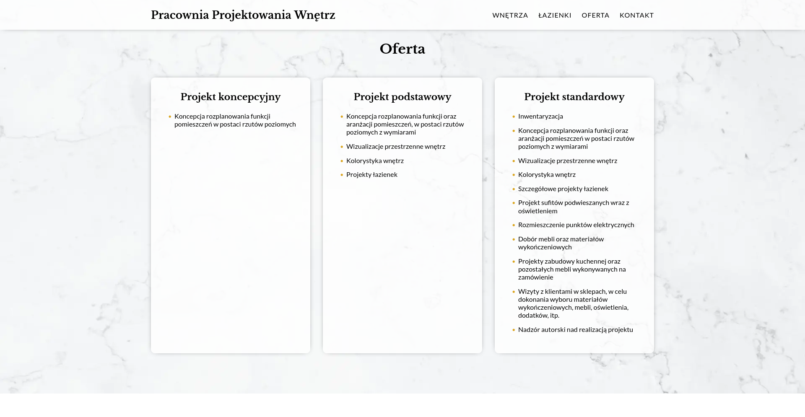
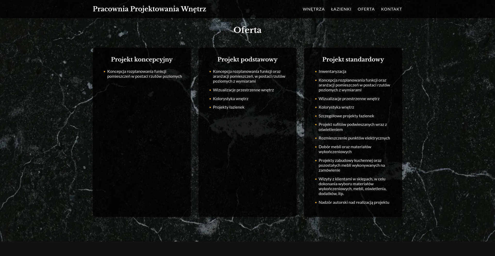
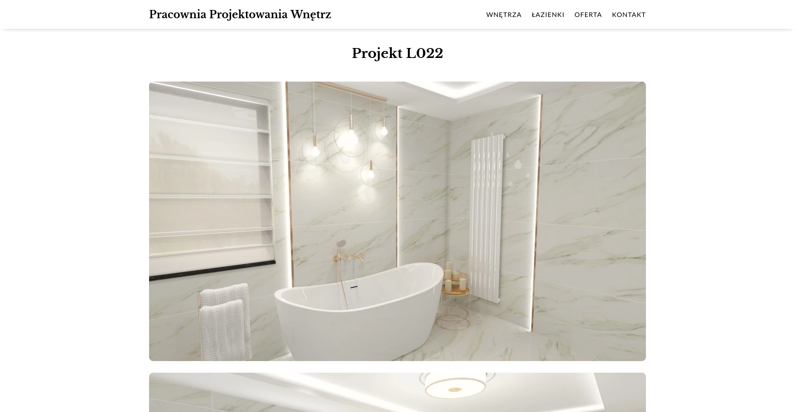

# Pracownia Projektowania Wnętrz

## About

This project is an interior designer's portfolio website I made for one of my clients. Built using HTML, SCSS and vanilla JavaScript. Put together with Vite.

It is only available in Polish 🇵🇱 language. Please just treat is as lorem ipsum. 😉

## Live Version

Available at https://projektywnetrz.net/

## Features

-   **Responsive Design**: Optimized for seamless use on both desktop and mobile devices.
-   **Light and Dark Modes**: Automatically adjusts to match the user's preferred theme.
-   **Automatic Portfolio**: All portfolio items on the home page and the project pages are automatically loaded based on the Project Dictionary file.
-   **Photo Slideshow**: Showcase all the latest projects with a smoothly animated carousel.
-   **Modern Minimalist Aesthetics**: Clean, professional design with consistent color schemes, fonts and style.
-   **User-Friendly Navigation**: Intuitive menus (desktop and mobile) for easy access to contact information, offer types and portfolio projects.

## Screenshots

## Run Locally

1. Clone the project to your local machine:

`git clone https://github.com/kaklewski/projekty-wnetrz`

2. Navigate to the project directory:

`cd projekty-wnetrz`

3. Install the dependencies:

`npm install`

4. Start the development server:

`npm run dev`

## Build with Vite

1. Build the dist:

`npm run build`

2. Preview the build:

`npm run preview`
